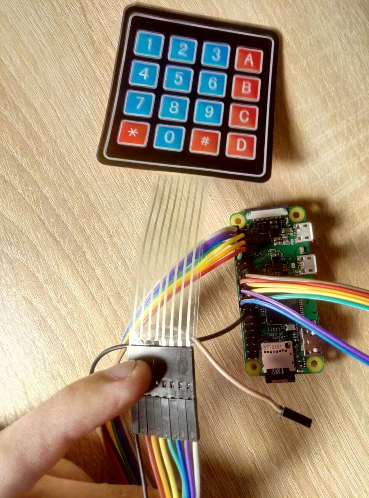
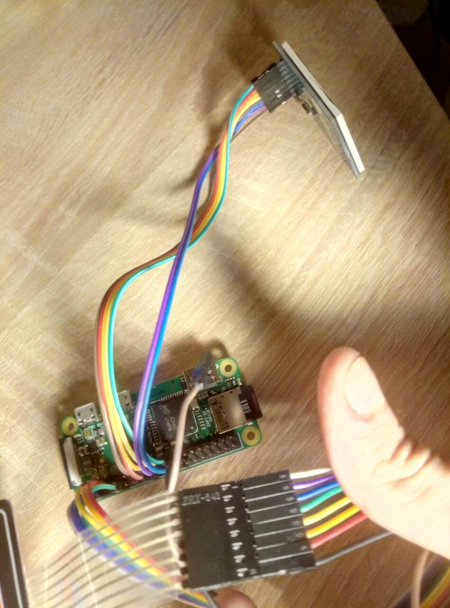

# Author

- Yaroslav Fedoriachenko
- Kyiv

# Title

4x4 japanese keyboard

# Description

This project is a PoC that provides input of hiragana and katakana using keypad-like 4x4 matrix keyboard and on-screen visualization of the keyboard.
To simplify drawing of characters a custom script is going to convert a 10x10 pixel ttf font to series of bitmaps in xbm format (that is basically a C header).

# Technical equipment.

 - 4x4 matrix keyboard
 - LCD Display based on ST7735 controller

# Pinout

# References

[Video](https://drive.google.com/file/d/1vIMtx0Iq_zUow0K363qm5QsIY-dnJYeN/view?usp=sharing)
